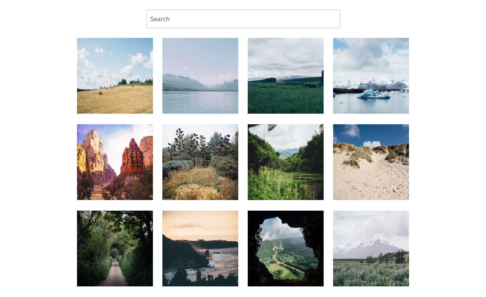
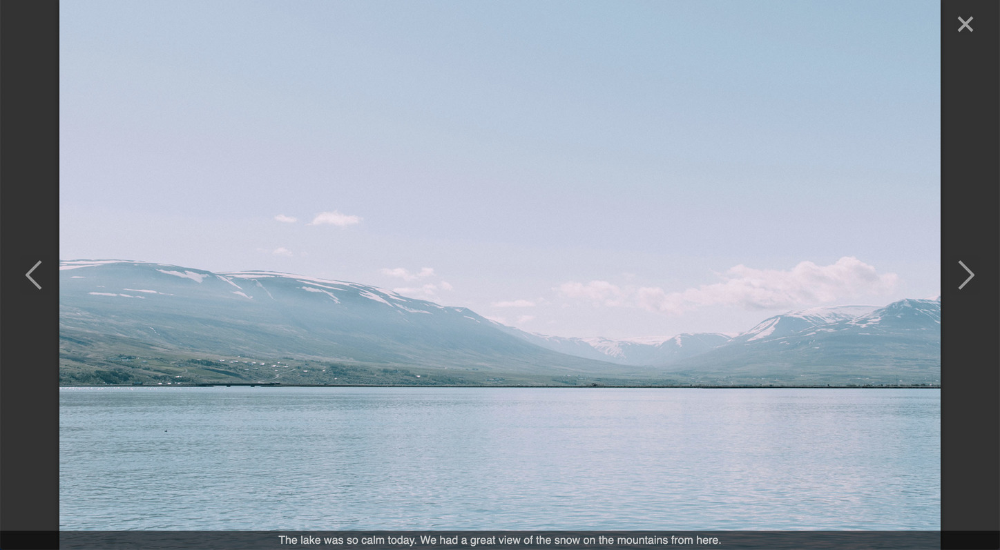
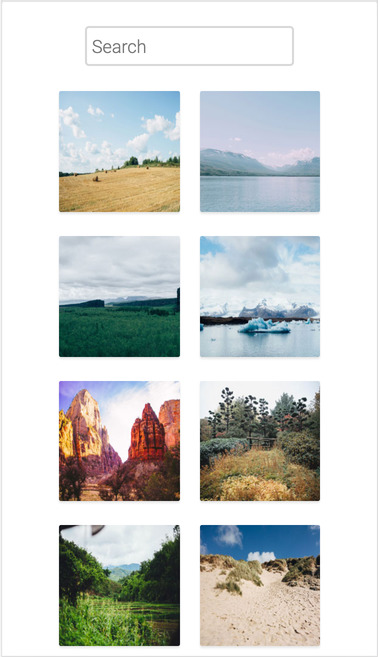
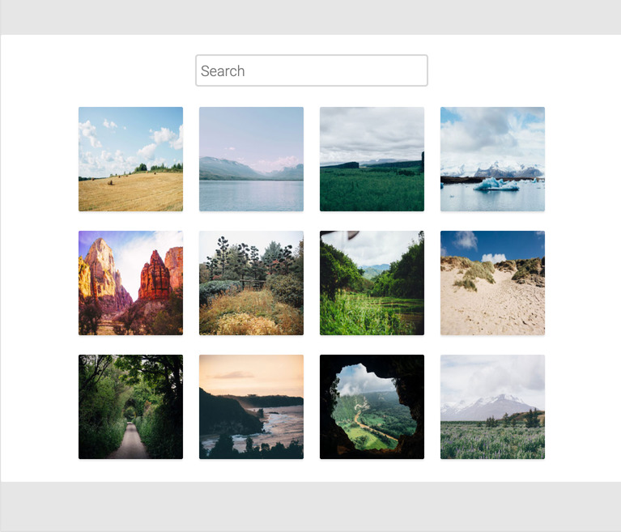
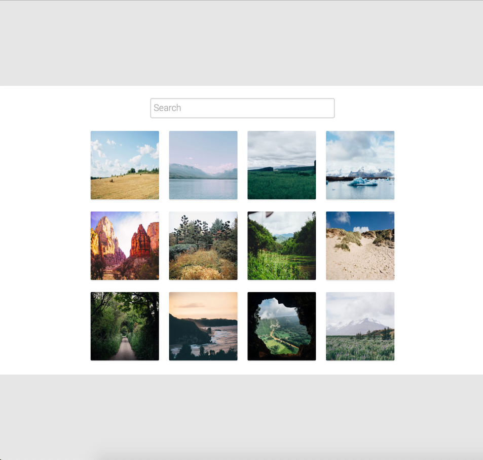
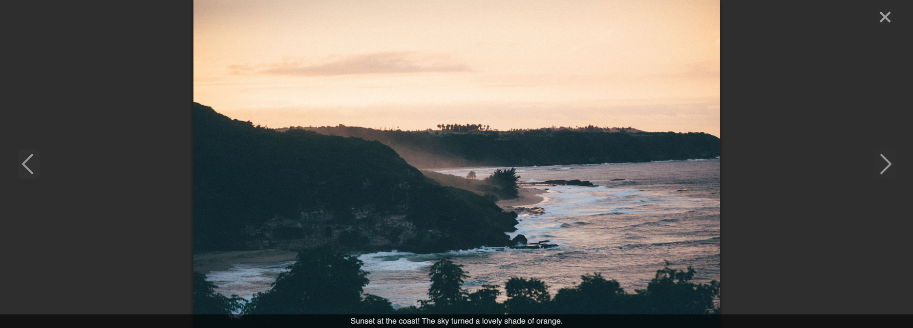

# interactive_photo_gallery
# An Interactive Photo Gallery Project

## Project Description
This project implements an interactive photo gallery that is built using HTML, CSS, and JavaScript. The gallery defines a responsive grid of thumbnails which can be clicked to display the associated image in full resolution along with a caption. The images can also be cycled through using arrow keys or by clicking the buttons.

The gallery also provides a search box where the user can type in search queries to display relevant images in the gallery.

## Demo

https://sidharthamishra.github.io/interactive_photo_gallery/

<br>

<hr>

## Project Task

The photo gallery was developed to resemble the following provided mockups (with some room for modifications):


<br>
*Mockup/Requirement Image of the Interative Photo Gallery Project*
<br>


<br>
*Mockup/Requirement Image of the Interative Photo Gallery Project*
<br>

*All images and captions were provided as starter files.*

<br>

## Project Outcome/Results
Upon completion, the project looks as follows:
<center>


<br>
*Screenshot of the Interative Photo Gallery Project - Desktop*
<br>

<br>
*Screenshot of the Interative Photo Gallery Project - Medium Mobile Tablet Screen*
<br>

<br>
*Screenshot of the Interative Photo Gallery Project - Large Desktop Screen*
<br>

*Screenshot of the Interative Photo Gallery Project - Individual Image Lightbox Powered by bagetteBox.js*

</center>

<br>

<hr>

## Project Structure
```
interactive_photo_gallery
    |
    |- css [output css folder for sass]
    |   |- baugetteBox.css
    |   |- index.css
    |   |- index.css.map
    |
    |- img
    |   |- [images used in project]
    |   |- thumbnails / [thumbnails used in the grid]
    |
    |- js
    |   |- baguetteBox.min.js
    |   |- app.js
    |
    |- resources
    |   |- docs_img
    |   |   |- screenshots_mockups / [resized images of mockups used in docs]
    |   |   |- screenshots_results / [resized images of results used in docs]
    |   |
    |   |- mockups / [originally provided mockups/screenshots]
    |   |
    |   |- photo_captions.txt [provided photo captions to be used in project]
    |
    |- scss
    |   |- base
    |   |   |- _index.scss
    |   |   |- _normalize.scss
    |   |
    |   |- components
    |   |   |- _gallery.scss
    |   |   |- _grid.scss
    |   |   |- _index.scss
    |   |   |- _search.scss
    |   |
    |   |- utilities
    |   |   |- _index.scss
    |   |   |- _variables.scss
    |   |
    |   |- index.scss
    |
    |- index.html
    |
    |- README.md

```
<br>

## Technologies and Tools Used
- HTML
- CSS
- JS
- Sass
- Google Fonts
- baguetteBox.js
- Chrome Dev Tools
- Markdown (Documentation)
- VS Code
- Tested on: Chrome, Firefox, Safari, Opera
- W3C HTML and CSS Validator
- JSHint

<br>

<hr>
